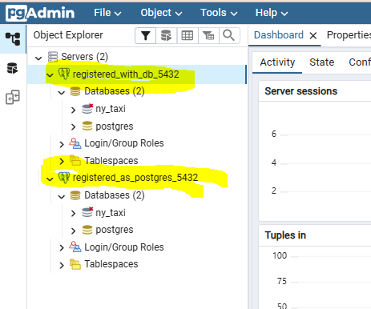
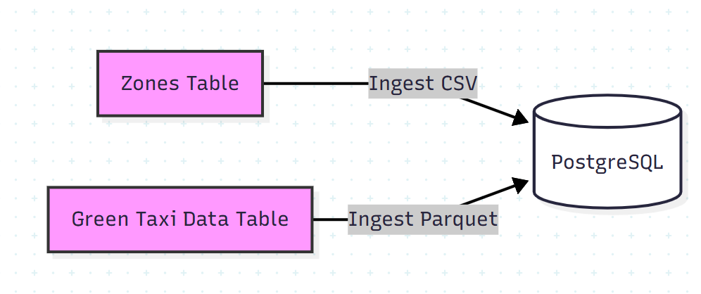
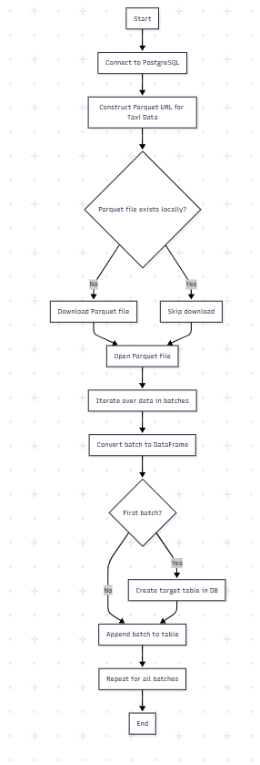

# Module 1 Homework: Docker & SQL

In this homework we'll prepare the environment and practice
Docker and SQL

When submitting your homework, you will also need to include
a link to your GitHub repository or other public code-hosting
site.

This repository should contain the code for solving the homework.

When your solution has SQL or shell commands and not code
(e.g. python files) file format, include them directly in
the README file of your repository.


## Question 1. Understanding Docker images

Run docker with the `python:3.13` image. Use an entrypoint `bash` to interact with the container.

What's the version of `pip` in the image?

- 25.3
- 24.3.1
- 24.2.1
- 23.3.1

```bash
@codespaces-2dd6f3:/workspaces/docker-workshop/01-docker-terraform/pipeline
> docker run -it  --entrypoint=bash python:3.13.10
root@e6198cb965f9:/# pip -V
pip XXX from /usr/local/lib/python3.13/site-packages/pip (python 3.13)
root@e6198cb965f9:/# 
exit
@codespaces-2dd6f3:/workspaces/docker-workshop/01-docker-terraform/pipeline
>
```

## Question 2. Understanding Docker networking and docker-compose

Given the following `docker-compose.yaml`, what is the `hostname` and `port` that pgadmin should use to connect to the postgres database?

```yaml
services:
  db:
    container_name: postgres
    image: postgres:17-alpine
    environment:
      POSTGRES_USER: 'postgres'
      POSTGRES_PASSWORD: 'postgres'
      POSTGRES_DB: 'ny_taxi'
    ports:
      - '5433:5432'
    volumes:
      - vol-pgdata:/var/lib/postgresql/data

  pgadmin:
    container_name: pgadmin
    image: dpage/pgadmin4:latest
    environment:
      PGADMIN_DEFAULT_EMAIL: "pgadmin@pgadmin.com"
      PGADMIN_DEFAULT_PASSWORD: "pgadmin"
    ports:
      - "8080:80"
    volumes:
      - vol-pgadmin_data:/var/lib/pgadmin

volumes:
  vol-pgdata:
    name: vol-pgdata
  vol-pgadmin_data:
    name: vol-pgadmin_data
```

- postgres:5433
- localhost:5432
- db:5433
- postgres:5432
- db:5432

If multiple answers are correct, select any 

```bash
> docker-compose -f docker-compose-homework.yaml up -d
[+] Running 2/2
 ✔ Container pgadmin   Started                                                                                                                                                                0.4s 
 ✔ Container postgres  Started                                                                                                                                                                0.4s 
@codespaces-2dd6f3:/workspaces/docker-workshop/01-docker-terraform/pipeline
> docker ps
CONTAINER ID   IMAGE                   COMMAND                  CREATED          STATUS         PORTS                                              NAMES
dc9f8f43c280   dpage/pgadmin4:latest   "/entrypoint.sh"         10 seconds ago   Up 9 seconds   443/tcp, 0.0.0.0:8080->80/tcp, [::]:8080->80/tcp   pgadmin
6c6abcbe5f23   postgres:17-alpine      "docker-entrypoint.s…"   10 seconds ago   Up 9 seconds   0.0.0.0:5433->5432/tcp, [::]:5433->5432/tcp        postgres
@codespaces-2dd6f3:/workspaces/docker-workshop/01-docker-terraform/pipeline
> 
```



## Prepare the Data

Download the green taxi trips data for November 2025:

```bash
wget https://d37ci6vzurychx.cloudfront.net/trip-data/green_tripdata_2025-11.parquet
```

You will also need the dataset with zones:

```bash
wget https://github.com/DataTalksClub/nyc-tlc-data/releases/download/misc/taxi_zone_lookup.csv
```

## Jupyter Notebook

Tested file downloads and upload into postgres in notebook_homework.ipynb

Converted jupyter notebook to ingest_date_homework.py

```bash
uv run jupyter nbconvert --to=script notebook.ipynb
mv notebook.py ingest_data.py
```

## Data Ingestion with Python

### Data Ingestion Flow Chart



Reading parquet file with pandas does not allow chukning, I had to switch to pyarrow.

But that method does not allow to read remote file, so I had to download the file first.

With the local file I was able to upload into the db in chunks.



```bash
# ingest with ingest_data.py
@codespaces-2dd6f3:/workspaces/docker-workshop/01-docker-terraform/pipeline
> uv run python ingest_data_homework.py --help
Usage: ingest_data_homework.py [OPTIONS]

Options:
  --table TEXT         Target table name  [default: green_tripdata]
  --year INTEGER       Year of the data  [default: 2025]
  --month INTEGER      Month of the data  [default: 11]
  --user TEXT          Database user  [default: postgres]
  --password TEXT      Database password  [default: postgres]
  --host TEXT          Database host  [default: localhost]
  --port INTEGER       Database port  [default: 5433]
  --db TEXT            Database name  [default: ny_taxi]
  --chunksize INTEGER  Size of data chunks  [default: 10000]
  --help               Show this message and exit.

# defaults will upload green_tripdata_2025-11
@codespaces-2dd6f3:/workspaces/docker-workshop/01-docker-terraform/pipeline
> uv run python ingest_data_homework.py
Connection to the database established
Zones table created
File green_tripdata_2025-11.parquet already exists. Skipping download.
0it [00:00, ?it/s]Table green_tripdata_2025-11 created
Inserted: 10000
1it [00:00,  1.01it/s]Inserted: 10000
2it [00:02,  1.01s/it]Inserted: 10000
3it [00:02,  1.02it/s]Inserted: 10000
4it [00:03,  1.05it/s]Inserted: 6912
5it [00:04,  1.12it/s]
```

Created container to ingest data by running ingest_date_homework.py

```bash
docker build -f Dockerfile_homework -t taxi_ingest_hw:v001 .

# load 2024 January
@codespaces-2dd6f3:/workspaces/docker-workshop
> docker run -it   --network=pipeline_default   taxi_ingest_hw:v001 --host=db --port=5432 --year=2024 --month=1
Connection to the database established
Zones table created
Downloading https://d37ci6vzurychx.cloudfront.net/trip-data/green_tripdata_2024-01.parquet ...
Downloaded to green_tripdata_2024-01.parquet
0it [00:00, ?it/s]Table green_tripdata_2024-01 created
Inserted: 10000
1it [00:01,  1.45s/it]Inserted: 10000
2it [00:02,  1.19s/it]Inserted: 10000
3it [00:03,  1.20s/it]Inserted: 10000
4it [00:04,  1.11s/it]Inserted: 10000
5it [00:05,  1.08s/it]Inserted: 6551
6it [00:06,  1.06s/it]
```

Switching to pgcli, I prefer CLI over PgAdmin GUI.

```bash
@codespaces-2dd6f3:/workspaces/docker-workshop/01-docker-terraform/pipeline
> uv run pgcli -h localhost -p 5433 -u postgres -d ny_taxi
```

## Question 3. Counting short trips

For the trips in November 2025 (lpep_pickup_datetime between '2025-11-01' and '2025-12-01', exclusive of the upper bound), how many trips had a `trip_distance` of less than or equal to 1 mile?

- 7,853
- 8,007
- 8,254
- 8,421

```sql
postgres@localhost:ny_taxi> select count(trip_distance) from "green_tripdata_2025-11" 
     where trip_distance<=1 
     and lpep_pickup_datetime between '2025-11-01' and '2025-12-01';
+-------+
| count |
|-------|
| XXXX  |
+-------+
```

## Question 4. Longest trip for each day

Which was the pick up day with the longest trip distance? Only consider trips with `trip_distance` less than 100 miles (to exclude data errors).

Use the pick up time for your calculations.

- 2025-11-14
- 2025-11-20
- 2025-11-23
- 2025-11-25

```bash
postgres@localhost:ny_taxi> select trip_distance, lpep_pickup_datetime  from "green_tripdata_2025-11" where trip_distance<100 order by trip_distance desc limit 1;
+---------------+----------------------+
| trip_distance | lpep_pickup_datetime |
|---------------+----------------------|
| 88.03         | XXXXXXXXXXXXXXXXXXX  |
+---------------+----------------------+
```

## Question 5. Biggest pickup zone

Which was the pickup zone with the largest `total_amount` (sum of all trips) on November 18th, 2025?

- East Harlem North
- East Harlem South
- Morningside Heights
- Forest Hills

```sql
postgres@localhost:ny_taxi> select b."Zone", sum(a.total_amount) from "green_tripdata_2025-11" a join zones b on a."PULocationID"=b."LocationID"  where lpep_pickup_datetime between '2025-11-18' and '2025-11-19' group by b."Zone
 " order by sum(a.total_amount) desc limit 1;
+-------------------+-------------------+
| Zone              | sum               |
|-------------------+-------------------|
| XXXXXXXXXXXXXXXXX | 9281.919999999996 |
+-------------------+-------------------+
```

## Question 6. Largest tip

For the passengers picked up in the zone named "East Harlem North" in November 2025, which was the drop off zone that had the largest tip?

Note: it's `tip` , not `trip`. We need the name of the zone, not the ID.

- JFK Airport
- Yorkville West
- East Harlem North
- LaGuardia Airport

```sql
postgres@localhost:ny_taxi> select b."Zone", a.tip_amount from "green_tripdata_2025-11" a 
     join zones b on a."DOLocationID"=b."LocationID"  
     join zones c on a."PULocationID"=c."LocationID" 
     where c."Zone"='East Harlem North'
     order by a.tip_amount desc 
     limit 1;
+----------------+------------+
| Zone           | tip_amount |
|----------------+------------|
| XXXXXXXXXXXXXX | 81.89      |
+----------------+------------+
```

## Terraform

In this section homework we'll prepare the environment by creating resources in GCP with Terraform.

In your VM on GCP/Laptop/GitHub Codespace install Terraform.
Copy the files from the course repo
[here](../../../01-docker-terraform/terraform/terraform) to your VM/Laptop/GitHub Codespace.

Modify the files as necessary to create a GCP Bucket and Big Query Dataset.


## Question 7. Terraform Workflow

Which of the following sequences, respectively, describes the workflow for:
1. Downloading the provider plugins and setting up backend,
2. Generating proposed changes and auto-executing the plan
3. Remove all resources managed by terraform`

Answers:
- terraform import, terraform apply -y, terraform destroy
- teraform init, terraform plan -auto-apply, terraform rm
- terraform init, terraform run -auto-approve, terraform destroy
- terraform init, terraform apply -auto-approve, terraform destroy
- terraform import, terraform apply -y, terraform rm


## Submitting the solutions

* Form for submitting: https://courses.datatalks.club/de-zoomcamp-2026/homework/hw1


## Learning in Public

We encourage everyone to share what they learned. This is called "learning in public".

### Why learn in public?

- Accountability: Sharing your progress creates commitment and motivation to continue
- Feedback: The community can provide valuable suggestions and corrections
- Networking: You'll connect with like-minded people and potential collaborators
- Documentation: Your posts become a learning journal you can reference later
- Opportunities: Employers and clients often discover talent through public learning

You can read more about the benefits [here](https://alexeyondata.substack.com/p/benefits-of-learning-in-public-and).

Don't worry about being perfect. Everyone starts somewhere, and people love following genuine learning journeys!

### Example post for LinkedIn

```
🚀 Week 1 of Data Engineering Zoomcamp by @DataTalksClub complete!

Just finished Module 1 - Docker & Terraform. Learned how to:

✅ Containerize applications with Docker and Docker Compose
✅ Set up PostgreSQL databases and write SQL queries
✅ Build data pipelines to ingest NYC taxi data
✅ Provision cloud infrastructure with Terraform

Here's my homework solution: <LINK>

Following along with this amazing free course - who else is learning data engineering?

You can sign up here: https://github.com/DataTalksClub/data-engineering-zoomcamp/
```

### Example post for Twitter/X


```
🐳 Module 1 of Data Engineering Zoomcamp done!

- Docker containers
- Postgres & SQL
- Terraform & GCP
- NYC taxi data pipeline

My solution: <LINK>

Free course by @DataTalksClub: https://github.com/DataTalksClub/data-engineering-zoomcamp/
```

