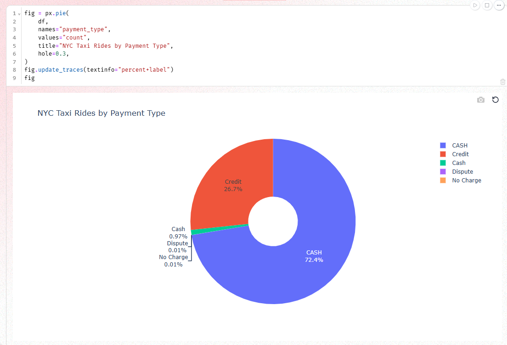
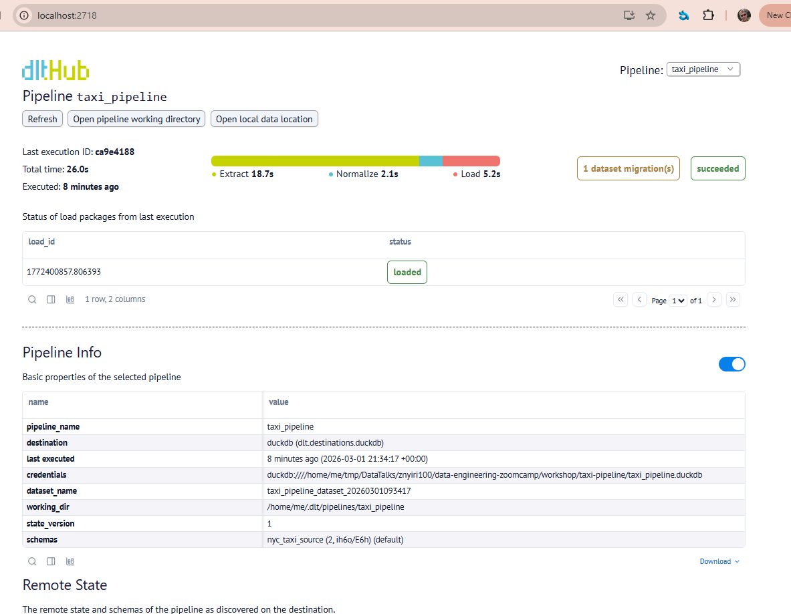

# taxi_pipeline

A dlt pipeline that loads NYC taxi trip data from the Data Engineering Zoomcamp REST API into DuckDB.

## Pipeline Details

| Property | Value |
|---|---|
| **Destination** | DuckDB |
| **Dataset** | `taxi_pipeline_dataset_20260301093417` |
| **Schema** | `nyc_taxi_source` |
| **Tables** | `rides` |
| **Rows** | 10,000 |
| **Date range** | 2009-06-01 → 2009-06-30 |
| **Last extracted** | 2026-03-01 21:34 UTC |

## Source

- **API**: `https://us-central1-dlthub-analytics.cloudfunctions.net/data_engineering_zoomcamp_api`
- **Format**: Paginated JSON, 1,000 records per page
- **Pagination**: Page-number (`?page=N`), stops on empty page
- **Authentication**: None

## Usage

Run the pipeline:

```bash
uv run python taxi_pipeline.py
```

Launch the payment type visualization notebook:

```bash
uv run marimo edit payment_types.py
```


```
dlt pipeline taxi_pipeline show
```


```
Question 1: What is the start date and end date of the dataset?
2009-01-01 to 2009-01-31
2009-06-01 to 2009-07-01
2024-01-01 to 2024-02-01
2024-06-01 to 2024-07-01

duckdb taxi_pipeline.duckdb -c "SELECT min(trip_pickup_date_time), max(trip_pickup_date_time) from taxi_pipeline_dataset_20260301093417.rides;"

Question 2: What proportion of trips are paid with credit card?
16.66%
26.66%
36.66%
46.66%

duckdb /home/me/tmp/DataTalks/znyiri100/data-engineering-zoomcamp/workshop/taxi-pipeline/taxi_pipeline.duckdb -c "SELECT payment_type, COUNT(*) as cnt, ROUND(COUNT(*) * 100.0 / SUM(COUNT(*)) OVER (), 2) as pct FROM taxi_pipeline_dataset_20260301093417.rides GROUP BY payment_type ORDER BY cnt DESC;"

Question 3: What is the total amount of money generated in tips?
$4,063.41
$6,063.41
$8,063.41
$10,063.41

duckdb taxi_pipeline.duckdb -c "SELECT sum(tip_amt) from taxi_pipeline_dataset_20260301093417.rides;"
```